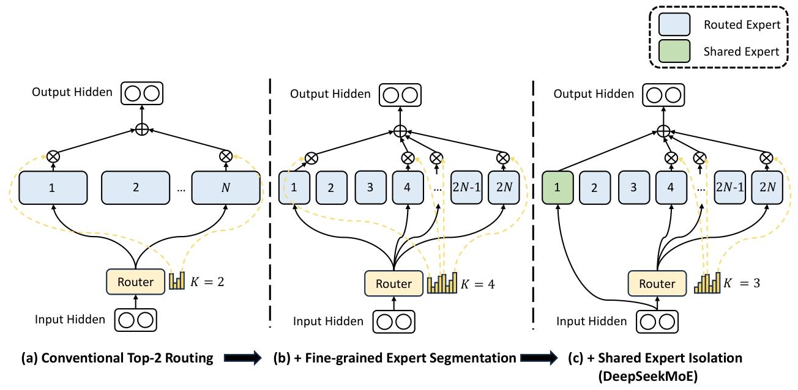
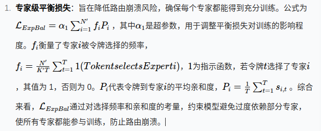
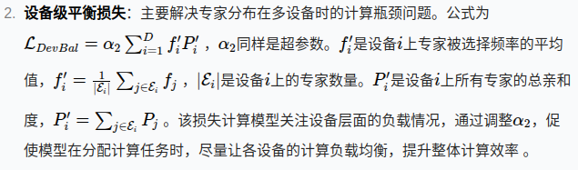

# MoE架构

    

## 细粒度专家分割

在专家数量有限的场景中，分配给特定专家的token更有可能涵盖多种类型的知识。因此，指定的专家会试图在其参数中学习极为不同类型的知识，但这些知识很难同时被有效利用。然而，如果每个令牌都能被路由到更多的专家，那么多样的知识就有可能被分解，并分别在不同的专家中学习。在这种情况下，每个专家仍可以保持较高的专业化水平，有助于在专家之间形成更集中的知识分布。

为了实现这一目标，在保持专家参数数量和计算成本不变的同时，我们对专家进行更细粒度的划分。更细粒度的专家划分能够实现激活专家的更灵活、更适配的组合。具体而言，在图 2（a）所示的典型 MoE 架构基础上，我们通过将 FFN 中间隐藏层维度缩小至原来的$\frac{1}{m}$，将每个专家 FFN 分割为**m**个较小的专家。由于每个专家变小了，相应地，我们也将激活专家的数量增加到**m**倍，以保持计算成本不变，如图 2（b）所示。

其中，专家参数的总数等于标准 FFN 参数数量的**N**倍，**mN**表示细粒度专家的总数。采用细粒度专家分割策略后，非零门的数量也将增加到**mK**。

从组合的角度来看，细粒度专家分割策略显著提高了激活专家的组合灵活性。例如，当N = 16\**时，典型的前 2 路由策略可以产生${\textstyle C_{16}^{2}}$种可能的组合。相比之下，如果每个专家被拆分为 4 个较小的专家，细粒度路由策略可以产生${\textstyle C_{64}^{8}}$ = 4,426,165,368*种潜在组合。组合灵活性的大幅提升增强了实现更精确、更有针对性的知识获取的潜力。

## 共享专家隔离

在传统的路由策略下，分配给不同专家的令牌可能需要一些共同的知识或信息。因此，多个专家可能会在各自的参数中获取共享知识，从而导致专家参数的冗余。然而，如果有专门的共享专家来捕获和整合不同上下文的通用知识，那么其他路由专家之间的参数冗余将得到缓解。这种冗余的减少将有助于构建一个参数效率更高、专家更专业化的模型。

为了实现这一目标，除了细粒度专家分割策略外，我们还进一步隔离出$(K_{s})$**个专家作为共享专家。无论路由模块如何，每个令牌都会被确定性地分配给这些共享专家。为了保持计算成本不变，其他路由专家中被激活的专家数量将减少**$K_{s}$个，如图 2（c）所示

# 负载均衡考量

自动学习的路由策略可能会遇到负载不均衡的问题，这表现出两个显著缺陷。首先，存在路由崩溃的风险（Shazeer 等人，2017），即模型总是只选择少数几个专家，导致其他专家无法得到充分训练。其次，如果专家分布在多个设备上，负载不均衡会加剧计算瓶颈。

## **专家级平衡损失**

为了降低路由崩溃的风险，我们还采用了专家级平衡损失。平衡损失的计算如下：

    $\begin{aligned}\mathcal{L}_{\text {ExpBal }} & =\alpha_{1} \sum_{i=1}^{N^{\prime}} f_{i} P_{i}, \\f_{i} & =\frac{N^{\prime}}{K^{\prime} T} \sum_{t=1}^{T} \mathbb{1}(\text { Token } t \text { selects Expert } i), \\P_{i} & =\frac{1}{T} \sum_{t=1}^{T} s_{i, t},\end{aligned}$

## **设备级平衡损失**

在试图缓解计算瓶颈时，在专家级别实施严格的平衡约束就变得没有必要，因为对负载平衡的过度约束会损害模型性能。相反，我们的主要目标是确保设备之间的计算平衡。如果我们将所有路由专家划分为**D**个组${E_{1}, E_{2}, ..., E_{D}}$，并将每个组部署在单个设备上，设备级平衡损失的计算如下：

    $\begin{aligned}\mathcal{L}_{\text {DevBal }} & =\alpha_{2} \sum_{i=1}^{D} f_{i}^{\prime} P_{i}^{\prime}, \\f_{i}^{\prime} & =\frac{1}{\left|\mathcal{E}_{i}\right|} \sum_{j \in \mathcal{E}_{i}} f_{j}, \\P_{i}^{\prime} & =\sum_{j \in \mathcal{E}_{i}} P_{j},\end{aligned}$

