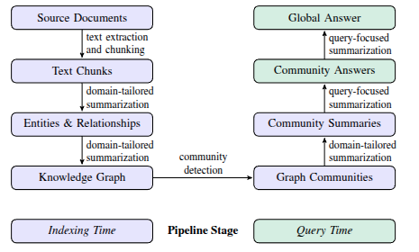

# GraphRAG 工作流程

## 1.源文档→文本块

将语料库中的文档分割为文本块。大语言模型从每个文本块中提取信息，以供后续处理。选择文本块的大小是一个基本的设计决策；较长的文本块在进行此类提取时需要的大语言模型调用次数较少，但会出现文本块中早期出现的信息召回率下降的问题(侧重关注文本块靠后的信息，导致前面部分信息被忽略)

## **2.**文本块→实体与关系****

* 多部分LLM prompt，首先识别文本中的所有实体，包括它们的名称、类型和描述，然后识别明确相关的实体之间的所有关系，包括源实体和目标实体以及它们关系的描述。

* 协变量提取，用于提取希望与节点实例关联的其他协变量。默认协变量prompt旨在提取与检测到的实体相关的声明，例如，某个实体作为主语或宾语的具体语句、时间信息等。
* 系统采用多轮“gleanings”，首先要求LLM评估是否提取了所有实体，使用100的logit偏差来强制做出是/否的决定。直到达到指定的最大次数，以鼓励LLM检测前几轮提取中可能遗漏的其他实体
* 领域定制：默认的提示是通用的，适用于一般的命名实体提取。但是，对于某些专业领域，需要提供特定的示例，使模型能更精准地提取相关的实体和关系。

假设一个文本块包含以下文本：

    “NeoChip（NC）的股票在 NewTech 交易所上市交易的第一周大幅上涨。然而，市场分析师警告称，这家芯片制造商的公开上市可能并不代表其他科技公司首次公开募股（IPO）的趋势。NeoChip 此前是一家私人企业，在 2016 年被 Quantum Systems 收购。这家创新的半导体公司专门生产用于可穿戴设备和物联网设备的低功耗处理器”。

    大语言模型会被促使提取出以下内容：

* 实体 NeoChip，描述为 “NeoChip 是一家上市公司，专门生产用于可穿戴设备和物联网设备的低功耗处理器”。
* 实体 Quantum Systems，描述为 “Quantum Systems 是一家曾拥有 NeoChip 的公司”。
* NeoChip 与 Quantum Systems 之间的关系，描述为 “Quantum Systems 从 2016 年至 NeoChip 上市期间拥有 NeoChip” 。

## **3.实体与关系→知识图谱**

* **实例整合** ：
  * 由于同一元素可能在不同文档中多次被提取，会产生多个实例，并且 LLM 可能以不同格式或方式提取同一实体信息，导致同一实体在图中可能被表示为多个不同节点，进而出现数据冗余和不一致的问题，需整合这些重复实例
  * 采用精确字符串匹配处理实体匹配，确保同一实体的不同描述能正确对应
* **构建知识图谱** ：经过处理，实体实例成为知识图谱的节点，关系实例形成边，关系的重复次数可作为边的权重，用于体现关系的紧密程度或重要性
* **潜在问题**，即大语言模型（LLM）在提取同一实体的引用时，可能无法始终保持相同的文本。
  * 这就可能导致出现重复的实体元素，进而在实体图中产生重复节点。
  * 尽管存在上述潜在问题，但该方法具有一定的应对能力。
    * 在后续步骤中，所有紧密相关的实体 “社区” 会被检测和总结。而且 LLM 具备理解同一实体不同名称变体背后共同实体的能力，只要这些变体与一组紧密相关的实体之间有足够的连接性，整个方法就能处理这些变体，不会对最终结果产生严重影响。

## 4.知识图谱→图社区

之前的步骤创建的索引，可以被构造为 **同质无向加权图** ，这种图结构中，所有节点和边都是同质的，连接关系没有方向，且每条边都带有权重。这种图模型用于表示实体及其之间的关系。对于这样的图，可以使用**社区检测算法**将图划分为节点社区，这些社区内的节点之间的连接比与图中其他节点的连接更强

* **社区检测算法的选择** ：论文采用了 Leiden 社区检测算法。因其能够在处理大规模图时，有效地发现**层次结构**而被选中。
* **层次化划分** (树)：
  * 使得图社区形成了一个多层次的结构，每个层次都代表了不同粒度的社区划分。
  * 每一层都将图中的节点分为不同的社区，且每个节点只属于一个社区（互斥）。
  * 所有节点都被分配到某个社区（集体穷尽）。
* **划分的意义** ：这种划分方式为分治策略的全局汇总提供了便利，在处理大规模数据时，可以先在各个小的社区内进行分析和处理，然后再逐步汇总到更高层次的社区，从而实现对整个知识图谱的高效理解和分析

## 5.图社区→社区摘要

* **生成报告式摘要** ：为 Leiden 层次结构中的每个社区创建类似报告的摘要，这些摘要可用于理解数据集的全局结构和语义，即便在没有具体查询时，也能帮助理解语料库。
* **叶级社区摘要生成** ：从最底层开始，逐步构建摘要，确保最重要的信息被包含在内

  * **元素摘要**，包括节点、边和相关声明
  * **优先级排序** ：根据节点的度数进行排序。
  * **摘要生成** ：
    * 按照优先级顺序，从高到低添加源节点、目标节点、关联的协变量以及边本身的描述到LLM（Large Language Model）的上下文窗口中。
    * 迭代添加直到达到上下文窗口的令牌限制
* **高层级社区摘要生成** ：若高层级社区中所有元素摘要能在上下文窗口 token 限制内，则如同叶级社区一样，直接汇总所有元素摘要 。若超出限制，先按元素摘要 token 数量对社区内的子社区进行降序排列，然后迭代地用子社区摘要（较短）替换相关的元素摘要（较长），直至满足上下文窗口的 token 限制。

  社区摘要建立在知识图谱的基础上，知识图谱中的实体、关系和声明是生成社区摘要的信息来源。通过对知识图谱的社区划分和摘要生成，将原本复杂的知识图谱信息转化为更易于理解和处理的摘要形式

{{
        "title": <report_title>,
        "summary": <executive_summary>,
        "rating": <impact_severity_rating>,
        "rating_explanation": <rating_explanation>,
        "findings": [
            {{
                "summary":<insight_1_summary>,
                "explanation": <insight_1_explanation>
            }},
            {{
                "summary":<insight_2_summary>,
                "explanation": <insight_2_explanation>
            }}
        ]
    }}

- title：代表其关键实体的社区名称 - 标题应简短但具体。如果可能，请在标题中包含代表性命名实体。
- summary：社区整体结构的执行摘要，包括其实体之间的相互关系以及与其实体相关的重要信息。
- rating：0-10 之间的浮动分数，表示社区内实体造成的影响的严重程度。影响是社区的重要性得分。
- rating_explanation：用一句话解释影响严重程度评级。
- findings：列出 5-10 个关于社区的关键见解。每个见解都应有一个简短的摘要，然后根据以下基本规则提供多段解释性文字。要全面。

## 6.社区摘要→社区答案→全局答案

当用户提出查询时，给定了社区层级，可以通过以下多阶段的过程生成最终答案：

* **准备社区摘要** ：将生成的所有社区摘要进行随机打乱，然后按照预先设定的 token(600) 大小进行分块。这一步的目的是让相关信息均匀分布在各个分块中，避免集中在单个上下文窗口导致部分信息丢失。
* **映射社区答案** ：
  * 并行地利用大语言模型（LLM）为每个分块的社区摘要生成中间答案。
  * LLM 还会为每个生成的答案给出一个 0 - 100 之间的分数，这个分数用于衡量该答案对回答目标问题的帮助程度。之后，会将分数为 0 的答案过滤掉，只保留有价值的中间答案
* **归约为全局答案** ：
  * 将过滤后的中间社区答案，按照帮助程度分数从高到低进行排序。
  * 依次将这些答案迭代添加到一个新的上下文窗口中，直到达到该上下文窗口的 token 限制。
