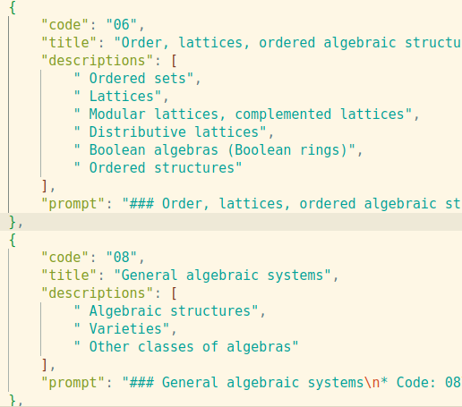

# 1.数据集收集

主要从如下公共数据集收集数据：

* Idavidrein/gpqa
* simplescaling/openaimath
* AI-MO/NuminaMath-CoT
* simplescaling/numinamath_500
* GAIR/OlympicArena
* TIGER-Lab/TheoremQA
* OpenDFM/SciEval
* Hothan/OlympiadBench
* daman1209arora/jeebench
* baber/agieval
* simplescaling/s1-prob
* 0xharib/xword1
* odegenning/usacobench_formatted
* simplescaling/s1-teasers
* livecodebench/code_generation_lite
* AI-MO/aimo-validation-aime
* simplescaling/openaimath
* livecodebench/code_generation_lite

从16个不同来源收集了59 029个初始问题，这些问题涵盖了天文学、生物学、化学、计算机科学、地理学、数学和物理学等各个奥林匹克竞赛项目，另外还包括英语、法律和逻辑推理等相关问题，并将其按照"question", "solution", "cot_type", "source_type", "metadata"五个字段重新组合

# 2.生成思维链

调用genai api，使用gemini-2.0-flash-thinking-exp模型对数据集中的每个问题生成思维链与答案，并增加如下字段保存思维链与解答过程：

* “thinking_trajectories”存储生成的思维链
* "attempt"保存生成的解答过程

# 3.生成解答过程

对步骤1收集数据集，分别使用Qwen2.5-7B-Instruct与Qwen2.5-32B-Instruct对每个问题生成解答过程，并使用attempt字段管理

# 4.分类数据集与答案判断

## 4.1 分类数据集

    对步骤2中生成的数据，调用claude-3-5-sonnet-20241022 api，根据设置的分类主题模版进行分类，返回对应类别的编号，分类模版如下图所示：

system prompt如下：

* ”You are a helpful assistant that classifies questions into different subjects based on the provided classification rubrics. "
* "You will be given a question and a list of subjects. "
* "You need to classify the question into one of the subjects. "
* "If the question has multiple subjects, you should classify the question into the most relevant subject. "
* "Explain your reasoning, and end your response on a new line with two-digit code of the subject that the question belongs to."

使用“code”字段管理每个问题的主题编号，根据编号将对应主题名更新到步骤1数据集中，使用“domian”作为字段

## 4.2 答案判断

对gemini-2.0-flash-thinking-exp、Qwen2.5-7B-Instruct与Qwen2.5-32B-Instruct对应问题生成的答案，进行如下处理：

* 使用claude-3-5-sonnet-20241022模型，调用api接口，判断生成的答案与标准答案相比是否正确，
* 若正确则返回“yes”，否则返回“No”，使用"grade"字段管理
* 返回判断理由，使用“reason”字段管理

分别将grade结果更新到步骤1数据集中，分别使用isgenminicorrect、isqwen7bcorrect与isqwen32bcorrect字段管理

## 4.3 思维链长度

对步骤2生成结构中的思维链，使用Qwen2.5-32B-Instruct计算token数，并该值更新到步骤1数据集中，使用“genmini_length”字段标识

# 5 过滤与采样

经过上述操作处理后，步骤1数据集每个条数据共有字段如下：

{"question", "solution", "cot_type", "source_type", "metadata"，“domian”，"isgenminicorrect"、"isqwen7bcorrect"，"sqwen32bcorrect"，“genmini_length”}

## 5.1 过滤数据集

* 过滤存在None的数据
* 移除包含特定格式或字符串的问题，如" `[asy]`"、"**`![Image]`**"、列表编号与加粗数字
* 过滤掉Qwen2.5-7B-Instruct与Qwen2.5-32B-Instruct能够解答的数据

## 5.2 采样数据集

* 收集isgenminicorrect为True，且来源为'Idavidrein/gpqa', 'qq8933/AIME_1983_2024'的数据
* 收集genmini_length>5600,且来源是qfq/openaimath的数据
* 如果采样数小于700，则从所有领域中均匀随机采样一个领域；否则，根据 `benchmark_weights` 权重采样一个领域。
* 从选中的领域中，根据问题的 `genmini_length` 进行加权采样，权重为 `2.0` 的负幂次方，即长度越长，排名靠前的，被选中的概率越大。
* 如果某个领域的问题被全部选中，则从 `all_domains` 和 `benchmark_domains` 中移除该领域，并调整 `benchmark_weights`。
* 更新进度条，直到 `采样数` 的大小达到1000

# 6 生成s1k数据集

将gemini-2.0-flash-thinking-exp生成的思维链与解答过程更新到采样得到的数据集，同时去掉“domian”，"isgenminicorrect"、"isqwen7bcorrect"，"sqwen32bcorrect"，“genmini_length”字段
