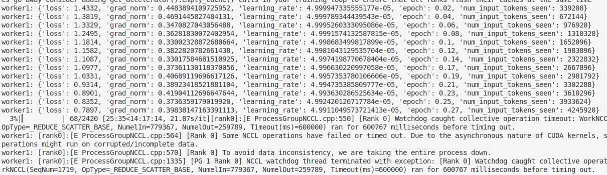

# 端口设置

export GRADIO_SERVER_PORT=8888# 指定端口为 8888
llamafactory-cli webui

# torchrun微调

分别在多个节点运行如下命令：
FORCE_TORCHRUN=1 NNODES=2 NODE_RANK=0 MASTER_ADDR=192.168.0.1 MASTER_PORT=29500 llamafactory-cli train examples/train_lora/llama3_lora_sft.yaml
FORCE_TORCHRUN为强制使用torchrun启动
NNODES节点数量
NODE_RANK各个节点的rank。
MASTER_ADDR主节点的地址。
MASTER_PORT主节点的端口

## 构建llamafactory环境 docker 镜像

推荐使用docker-compose 进行构建

## 创建容器

docker run -dit --gpus=all --ipc=host  
-v ./hf_cache:/root/.cache/huggingface 
-v ./ms_cache:/root/.cache/modelscope 
-v ./om_cache:/root/.cache/openmind 
-v  /home/km/workspace/python/LLM/models:/app/models 
-v  /home/km/workspace/python/LLM/LLaMA-Factory/data:/app/data 
-v  /home/km/workspace/python/LLM/LLaMA-Factory/saves:/app/saves 
--shm-size 16G 
--name llamafactory-1 
docker-cuda-llamafactory:latest
需要挂着模型文件与数据集所在的data文件，启动共享host

## 问题

### 长时间挂起等待，并最终报错torch.distributed.DistNetworkError: The client socket has timed out after

尝试使用torchrun启动，命令如下：
export MASTER_ADDR=192.168.80.164
export MASTER_PORT=29500
CUDA_VISIBLE_DEVICES=0 torchrun 
--nproc_per_node=1 
--nnodes=2 
--node_rank=0  
--master_addr=$MASTER_ADDR 
--master_port=29500 
src/train.py 
--stage sft 
--do_train True 
--model_name_or_path /home/km/workspace/python/LLM/models/DeepSeek-R1-Distill-Qwen-1.5B 
--preprocessing_num_workers 16 
--finetuning_type lora 
--template qwen 
--flash_attn auto 
--dataset_dir data 
--dataset gongxu_alpaca 
--cutoff_len 8192 
--learning_rate 5e-05 
--num_train_epochs 10.0 
--per_device_train_batch_size 1 
--gradient_accumulation_steps 8 
--lr_scheduler_type cosine 
--max_grad_norm 1.0 
--logging_steps 5 
--save_steps 50 
--warmup_steps 0 
--packing False 
--report_to none 
--output_dir saves/Qwen2.5-7B-Instruct/lora/1 
--bf16 True 
--plot_loss True 
--ddp_timeout 180000000 
--include_num_input_tokens_seen True 
--optim adamw_torch 
--lora_rank 8 
--lora_alpha 16 
--lora_dropout 0 
--lora_target all \

### 仍然长时间挂起等待，并最终报错torch.distributed.DistNetworkError: Connection reset by peer

弹性、容错的分布式训练，尝试添加如下参数启动：
--max-restarts=3 
--rdzv_id=123 
--rdzv-backend=c10d 
--rdzv_endpoint $MASTER_ADDR:29400 \

### torch.distributed.elastic.rendezvous.api.RendezvousConnectionError: The connection to the C10d store has failed.

https://github.com/ymcui/Chinese-LLaMA-Alpaca-2/issues/274 根据该issue，怀疑是环境不一致问题导致，因此构建docker镜像，保持多个机器的环境一致

### docker导入错误，docker导入镜像报错：invalid diffID for layer xxx: expected “sha256:xxx“, got “sha256:xxx“

重试导入命令解决,docker load -i ubuntu_image.tar

### docker容器启动，仍然报错torch.distributed.elastic.rendezvous.api.RendezvousConnectionError: The connection to the C10d store has failed.

未找到明确的解决方法，尝试使用deepspeed进行多机多卡训练

# deepspeed多机多卡训练

## 配置两个容器之间ssh root权限免密登录

在文件/etc/hosts中，添加两个容器ip：
192.168.80.164 server1
192.168.80.134 server2
确保每个容器都能够ssh root@server1、ssh root@server2访问成功
注意：容器在--net=host下创建，是与宿主机共享ip与端口，如果使用默认22端口，仅只能访问宿主机，不能连接到容器，因此要修改默认端口，修改如下两个文件：
/etc/ssh/ssh_config
/etc/ssh/sshd_config
重启ssh服务，service ssh retart

## 训练命令

deepspeed --hostfile hostfile 
src/train.py 
--deepspeed examples/deepspeed/ds_z3_offload_config.json 
--stage sft 
--do_train True 
--model_name_or_path  /app/models/Qwen2.5-0.5B-Instruct 
--preprocessing_num_workers 16 
--finetuning_type lora 
--template qwen 
--flash_attn auto 
--dataset_dir data 
--dataset CoT_Fine_tune 
--cutoff_len 8192 
--learning_rate 5e-05 
--num_train_epochs 10.0 
--per_device_train_batch_size 1 
--gradient_accumulation_steps 4 
--lr_scheduler_type cosine 
--max_grad_norm 1.0 
--logging_steps 5 
--save_steps 200 
--warmup_steps 0 
--packing False 
--report_to none 
--output_dir saves/Qwen2.5-0.5B-Instruct/lora/sft 
--bf16 True 
--plot_loss True 
--ddp_timeout 180000000 
--include_num_input_tokens_seen True 
--optim adamw_torch \

## 问题

### ncclSystemError: System call (e.g. socket, malloc) or external library call failed or device error.

export NCCL_DEBUG=INFO
export NCCL_IB_DISABLE=1
export NCCL_SOCKET_IFNAME=enp4s0，此处enp4s0为每台机器的网卡名字，使用ifconfig查看，要是出现多个网卡名字，找到那个右IP地址、网关和掩码的那个名字，这一步是最重要的

### torch.cuda.OutOfMemoryError: CUDA out of memory

export PYTORCH_CUDA_ALLOC_CONF=expandable_segments:True
仍然报错，尝试使用更小的模型——Qwen2.5-0.5B-Instruct

### NCCL WARN Bootstrap : no socket interface found or NCCL INFO Call to connect returned Connection refused, retrying

出现该问题主要是由于无法正常访问IP的问题，将 NCCL_SOCKET_IFNAME 设置为 IP 的设备。
export NCCL_SOCKET_IFNAME=enp

### The server socket has failed to listen on any local network address. The server socket has failed to bind to [::]:29500 (errno: 98 - Address already in use). The server socket has failed to bind to ?UNKNOWN? (errno: 98 - Address already in use).

--master_port 29600

### docker 容器 Failed to initialize NVML: Unknown Error

重启容器

### bootstrap.cc:48 NCCL WARN Bootstrap : no socket interface found

export NCCL_SOCKET_IFNAME=enp

### misc/socket.cc:484 NCCL WARN socketStartConnect: Connect to 172.17.0.1<39275> failed : Software caused connection abort

### NCCL WARN socketProgress: Connection closed by remote peer server2

总是出现该错误，研究发现仍然是通讯问题
研究使用Overlay网络（Docker Swarm集群方案）进行通信

### Overlay配置

1.选用服务器1作为manage节点进行初始化，执行docker swarm init
2.将服务器2加入集群，执行以下命令：
docker swarm join --token SWMTKN-1-1zag1cf7n1o21cu88dyanbhlrbhrjicztf9qlyryt08w56k3ba-9pu6zhn2klfv2qm0bnaysm4lo 192.168.6.98:2377
3.创建deepspeed环境需要的网络
docker network create  --driver overlay  --subnet=10.10.0.0/24  --gateway=10.10.0.1 --attachable  my-overlay
subnet设置子网，gateway设置网关
4.创建容器
docker run -dit --gpus=all --network  my-overlay 
-v ./hf_cache:/root/.cache/huggingface 
-v ./ms_cache:/root/.cache/modelscope 
-v ./om_cache:/root/.cache/openmind 
-v  /home/km/workspace/python/LLM/models:/app/models 
-v  /home/km/workspace/python/LLM/LLaMA-Factory/data:/app/data 
-v  /home/km/workspace/python/LLM/LLaMA-Factory/saves:/app/saves 
--shm-size 16G 
--name llamafactory-2 
docker-cuda-llamafactory:latest
其中注意参数--shm-size，必须设置足够大空间

### 创建容器出现 docker: Error response from daemon: error creating external connectivity network: all predefined address pools have been fully subnetted.

vim /etc/docker/daemon.json
添加以下内容:
{
"default-address-pools": [
{"base":"172.17.0.0/16","size":24},
{"base":"172.18.0.0/16","size":24},
{"base":"172.19.0.0/16","size":24},
{"base":"172.20.0.0/16","size":24},
{"base":"172.21.0.0/16","size":24}
]
}
保存文件后，重启docker
问题原因:
默认地址池耗尽
Docker 默认的地址池为 172.17.0.0/16、172.18.0.0/24 等，每个子网可分配的 IP 数量有限。当频繁创建网络或容器时，尤其是使用 Overlay 网络（如 Swarm 模式），可能导致子网被完全划分。

子网配置冲突
Docker 自动分配的子网可能与宿主机现有网络（如物理网络、VPN 或路由表）冲突。例如，若宿主机路由表中已存在 10.0.0.0/8 的条目，而 Docker 尝试分配 10.252.0.0/24 子网时，会因范围重叠而失败。

未清理的残留网络配置
删除 Docker 网络后，若未清理 /var/lib/docker/network 目录中的缓存文件，可能导致 Docker 误认为地址池仍被占用

### Could not attach to network my-overlay: rpc error: code = PermissionDenied desc = network my-overlay not manually attachable.

这是因为使用docker network 命令创建时，没有添加  --attachable参数。

### 训练过程保存模型时，报错Some NCCL operations have failed or timed out. Due to the asynchronous nature of CUDA kernels, subsequent GPU operations might run on corrupted/incomplete data.

### If this call came from a _pb2.py file, your generated code is out of date and must be regenerated with protoc >= 3.19.0. Downgrade the protobuf package to 3.20.x or lower.Set PROTOCOL_BUFFERS_PYTHON_IMPLEMENTATION=python (but this will use pure-Python parsing and will be much slower).

pip install protobuf==3.20.1 -i https://pypi.tuna.tsinghua.edu.cn/simple

### launcher 'pdsh' not installed.

apt-get install pdsh

### "/usr/lib": Owner not root, current uid, or pdsh executable owner

chown root /usr/lib 修改用户组

### Error while creating shared memory segment /dev/shm/nccl-aKifJm (size 4194656)

shared memory 空间太小，多卡或多节点训练需要更大空间
df -h /dev/shm  # 查看共享内存的可用空间
若空间不足：临时增大共享内存：bash
sudo mount -o remount,size=8G /dev/shm  # 调整共享内存为 8GB（根据需求调整）
最好在创建容器是设置参数--shm-size 16G

### 顺利启动

### 中断出现报错，Some NCCL operations have failed or timed out. Due to the asynchronous nature of CUDA kernels, subsequent GPU operations might run on corrupted/incomplete data.To avoid data inconsistency, we are taking the entire process down.

通信的实现方式分为两种类型：机器内通信与机器间通信。

机器内通信：

* 共享内存（QPI/UPI），比如：CPU与CPU之间的通信可以通过共享内存。
* PCIe，通常是CPU与GPU之间的通信。
* NVLink，通常是GPU与GPU之间的通信，也可以用于CPU与GPU之间的通信。

机器间通信：

* TCP/IP 网络协议。
* RDMA (Remote Direct Memory Access) 网络协议。
  * InfiniBand
  * [iWARP](https://zhida.zhihu.com/search?content_id=237885816&content_type=Article&match_order=1&q=iWARP&zhida_source=entity)
  * [RoCE](https://zhida.zhihu.com/search?content_id=237885816&content_type=Article&match_order=1&q=RoCE&zhida_source=entity)

InfiniBand网络互连产品包括：**DAC高速铜缆**、**AOC有源线缆**以及**光模块**

InfiniBand 的网络架构

InfiniBand 是一种基于通道的结构，组成单元主要分为四类：

* HCA（Host Channel Adapter，主机通道适配器）
* TCA（Target Channel Adapter，目标通道适配器）
* InfiniBand link（连接通道，可以是电缆或光纤，也可以是板上链路）
* InfiniBand交换机和路由器（组网用的）
